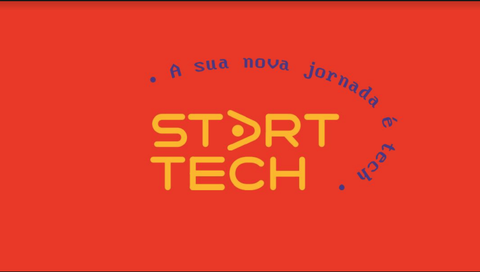

# Start Tech Dev Program

<h1 align="center";>
  
</h1>

  <a href="#-tecnologias">Tecnologias</a>&nbsp;&nbsp;&nbsp;|&nbsp;&nbsp;&nbsp;
  <a href="#-projeto">Projeto</a>&nbsp;&nbsp;&nbsp;|&nbsp;&nbsp;&nbsp;
  <a href="#-layout">Layout</a>&nbsp;&nbsp;&nbsp;|&nbsp;&nbsp;&nbsp;
  <a href="#memo-licença">Licença</a>

 

  

**MPORTANTE** - Tudo está detalhado no
<a href='https://drive.google.com/file/d/1NBwVlh_y3ab9QGsppd7qKYFopJAQyKjr/view
/' target='_blank'>Manual de Sobrevivência</a>
, não deixem de ler!

<a href='https://docs.google.com/spreadsheets/d/1L1xIIOu8jxizG-88Zu1vIBM2nzIyZLPyK8GEIUkDGyE/edit?usp=sharing/' target='_blank'>**-> cronograma das aulas**</a>

 

  

## 🚀 Tecnologias

Esse projeto foi desenvolvido com as seguintes tecnologias:

- [x] HTML
- [x] CSS
- [x] JavaScript
- [x] Git/Github
- [x] Metodologias Ágeis
- [ ] Graphql
- [ ] Node
